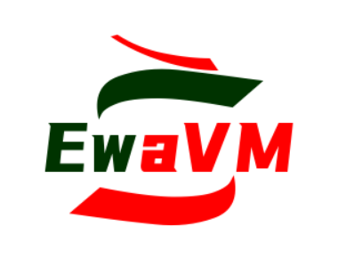

# EwaVM: 下一代的轻量级WebAssembly容器环境

## 简介

EwaVM (a lightweight & embedded WebAssembly's VM) 是为下一代Serverless和Web容器而开发的轻量级可嵌入的WebAssembly虚拟机和运行时

GitHub: https://github.com/EwaVM/EwaVM

Gitee: https://gitee.com/ewa-vm/EwaVM

开源许可证：Apache 2.0 (商业友好!)

## 特点

- 完全支持WebAssembly的字节码特性
- 完全基于堆栈式JIT执行(不会有任何解释器影响效率)
- 基于高效的SLJIT模块，快速预热，无需等待即可进入高效执行状态
- 最低的内存占用，没有任何额外开销，加载时JIT编译器既完成所有指令编译
- 更强大的模块支持和多种语言绑定

## 支持情况

支持操作系统：Windows Linux MacOS ...

支持工具链：GCC、MinGW GCC、LLVM Clang、TinyCC

支持架构 (SLJIT)：X86/64、ARM/ARM64/AArch64、RISC-V 32/64、MIPS 32/64、PowerPC 32/64

## 开发情况
本项目长期开发维护，推荐大家使用VSCode开发环境
- 本项目欢迎PR和Issue（Gitee仅支持Issue，提交PR请移步GitHub）
- 本项目同时接受`国产操作系统`的移植请求，我们非常乐意支持，请提交Issue
- 同时，欢迎大家加入社群探讨

## TODO
- 提供命令行 (CLI)环境
- 提供更多例程和语言绑定
- 添加WASI支持和SIMD指令加速

## 致谢

Standrard: https://webassembly.org/

SLJIT: https://github.com/zherczeg/sljit

Tools: https://github.com/WebAssembly/wabt
